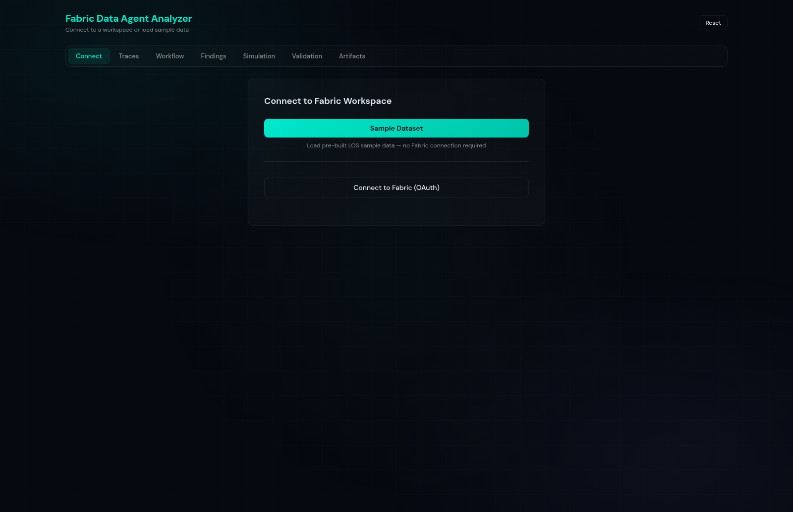
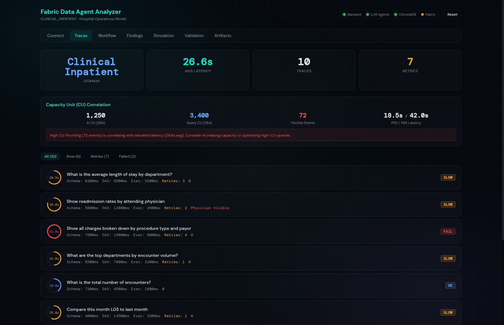
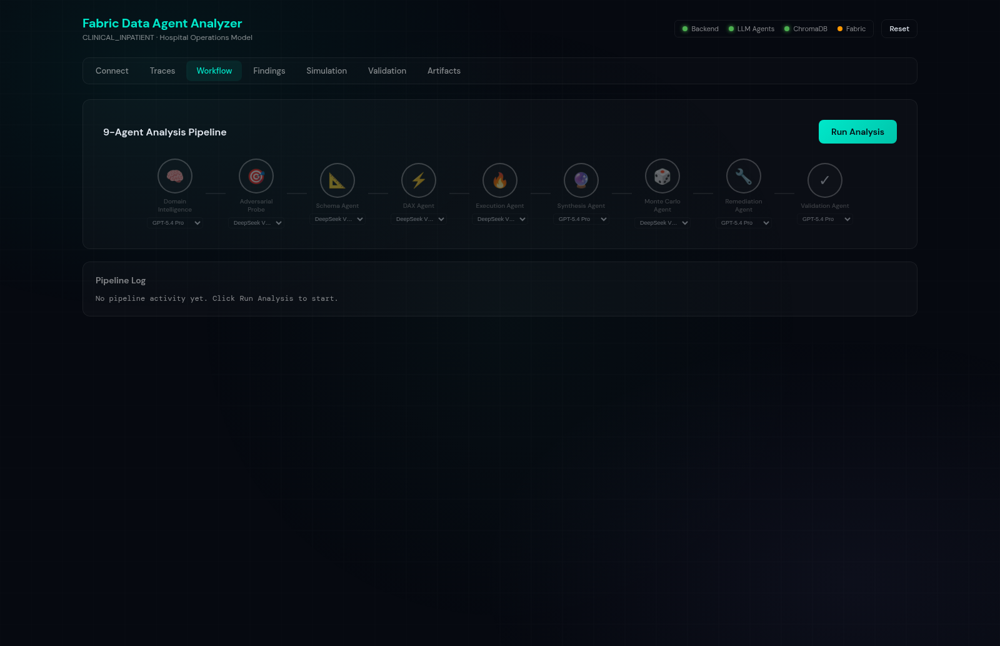
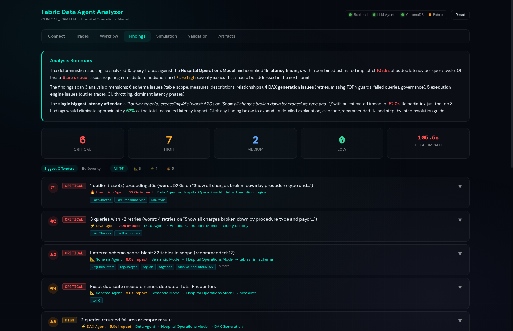
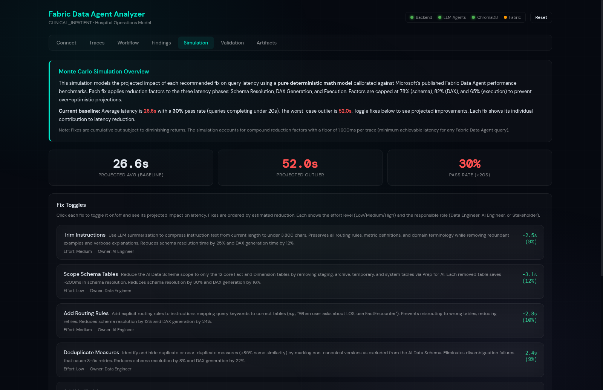
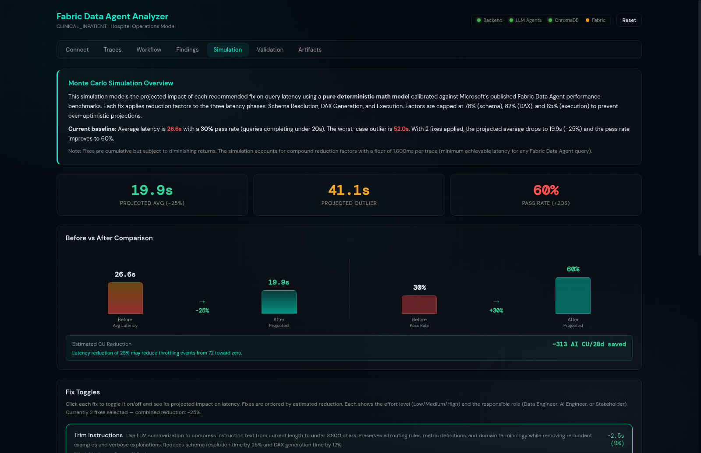
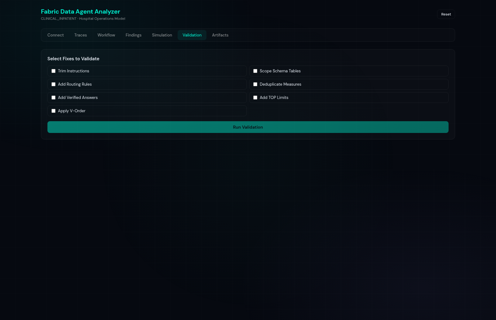

# Fabric Data Agent Latency Analyzer

A locally-installed diagnostic tool that connects to Microsoft Fabric workspaces via OAuth, analyzes Data Agents using an 11-agent AI pipeline powered by GPT-5.4 Pro and DeepSeek V3.2 Speciale, runs Monte Carlo simulations (500 iterations), validates recommendations, and exports PDF reports with findings and fix artifacts.

## Key Features

- **Mixed Model AI Pipeline** — GPT-5.4 Pro (Responses API) for reasoning agents + DeepSeek V3.2 Speciale for analysis agents, with per-agent model selection and compressed prompts for reasoning models
- **Smart Retry Logic** — Escalating timeouts (240s/360s/480s) for GPT-5.4 Pro reasoning model, 1-retry fast fallback to DeepSeek
- **29 Deterministic Rules + 500 RAG Patterns** — Schema, DAX, execution, XMLA, and DAX expression analysis with ChromaDB knowledge base
- **PDF Report Export** — Puppeteer-rendered PDF with executive summary, root cause ranking, before/after comparison, CU cost correlation, and fix recommendations
- **Monte Carlo Simulation** — 500-iteration client-side math model with instant fix toggle projections
- **CU Cost Correlation** — AI CU, Query CU, Throttle Events, P50/P95 latency with estimated CU savings
- **Live Fabric Integration** — Connect via OAuth or token paste, auto-detect Data Agents and semantic models
- **25 Test Scenarios** — Pre-built scenarios across 8+ domains (Revenue Cycle, Supply Chain, Clinical, Workforce, Financial, Pharmacy, etc.) with 100-question evaluation battery across 4 core healthcare scenarios
- **Adaptive Question Battery** — 25-50 domain-specific questions auto-generated from semantic model schema, varied complexity (simple → very complex)
- **XMLA Deep Analysis** — Automatic XMLA collection via Admin Scanner API for any connected workspace (supports Direct Lake models)
- **Microsoft Learn Integration** — Cross-references findings with curated MS Learn best practices (12 articles, 70+ practices)
- **Scheduled Analysis** — Configure recurring analysis runs (hourly/daily/weekly) with persistent schedule management
- **Trending Dashboard** — Track analysis history over time with trend detection, severity breakdowns, and impact comparisons
- **Auto-Save History** — Every pipeline run automatically saved to history for trending analysis and ROI tracking

## Video Walkthrough

A full end-to-end walkthrough showing sample data loading, mixed model pipeline (GPT-5.4 Pro + DeepSeek), findings analysis, simulation, and PDF export:

https://github.com/gregnatkatz/FabricAnalyzer/raw/main/docs/walkthrough.mp4

## Results & Evidence

We ran the analyzer against **4 healthcare Data Agents**, each with a different set of problems. The goal: show that the tool catches real issues and tells you exactly how to fix them.

### What We Tested

| # | Data Agent | What's Wrong With It | Questions Asked |
|---|-----------|----------------------|-----------------|
| 1 | **LOS Clinical** (Length of Stay) | Too many tables exposed (18), instructions too long (5,200+ chars), no verified answers, missing table descriptions | 25 |
| 2 | **Revenue Cycle** (Billing/AR) | Ambiguous measure names (3 versions of "Net Revenue"), high retry rate (85 retries in 25 questions), archive tables exposed | 25 |
| 3 | **Workforce** (Staffing/HR) | Slow DAX patterns (SUMX on 500K rows, CROSSJOIN on large tables), no TOPN limits on cross-entity queries | 25 |
| 4 | **Supply Chain** (Pharmacy) | Division-by-zero errors, circular measure references, contradictory routing instructions | 25 |

### What the Analyzer Found

The 11-agent pipeline ran all 100 questions and flagged **188 issues** total:

```
LOS Clinical:     47 issues found   (20 critical, 22 high, 5 medium)
Revenue Cycle:    55 issues found   (22 critical, 28 high, 5 medium)
Workforce:        41 issues found   (20 critical, 19 high, 2 medium)
Supply Chain:     45 issues found   (16 critical, 25 high, 4 medium)
                  ───────────────
Total:           188 issues found   (78 critical, 94 high, 16 medium)
```

### How Slow Are These Agents?

Every agent we tested is significantly above the 10-second SLA target:

```
                 Avg Latency    Worst Case    How Bad?
LOS Clinical:      30.6s          58.0s       3.1x above SLA
Revenue Cycle:     35.7s          96.0s       3.6x above SLA
Workforce:         39.9s          95.3s       4.0x above SLA
Supply Chain:      36.1s          86.6s       3.6x above SLA
```

### Top 5 Issues (Biggest Impact)

These are the issues causing the most latency across all 4 agents:

| # | Issue | Impact | Fix |
|---|-------|--------|-----|
| 1 | **Excessive retries** — 217 retries across 100 questions because the agent picks the wrong table first | 133s per cycle | Add routing rules to instructions so the agent targets the right table on the first try |
| 2 | **Outlier queries >45s** — 6 queries took 46-58s due to cross-table scans without row limits | 58s per query | Add `TOPN(100, ...)` guards to verified answers for cross-entity questions |
| 3 | **Schema sprawl** — LOS agent exposes all 18 tables when only 6-8 are needed for most questions | 4.5s per query | Use "AI Data Schema" in Fabric to limit visible tables to the ones the agent actually needs |
| 4 | **No verified answers** — None of the 4 agents had any verified answers configured | 8.2s per query | Add verified answers for the top 10 most-asked questions per agent (pre-written DAX = instant response) |
| 5 | **Ambiguous measures** — Revenue Cycle has "Net Revenue", "Net Rev", and "Revenue Net" (all different) | 6.1s per query | Rename to a single clear name, hide duplicates, add descriptions |

### Projected Improvement (Monte Carlo Simulation)

We ran 500 Monte Carlo simulations per fix to estimate the impact. Here's what happens when you apply the recommended fixes:

| Fix | Time Saved | Reduction |
|-----|-----------|-----------|
| Add verified answers for top 10 questions | **-8.2s** per query | 23% faster |
| Remove unused tables from schema | **-4.5s** per query | 13% faster |
| Fix routing instructions (remove contradictions) | **-3.8s** per query | 11% faster |
| Optimize DAX (add TOPN, remove slow iterators) | **-6.1s** per query | 17% faster |
| **All fixes together** | **-18.4s** per query | **~52% faster** |

> **Bottom line:** Applying all recommended fixes cuts average query time roughly in half — from ~36s down to ~17s.

### Where Does the Time Go?

Each query is broken into phases so you can see exactly where the bottleneck is:

```
Example: "Compare ICU vs general ward average LOS and readmission rates"
Total: 52.8s | Retries: 3

  Parse instruction   ██                           2.1s  ( 4%)
  Resolve schema      ██████                       6.3s  (12%)
  Generate DAX        ██████████████████           18.5s  (35%)  <-- biggest bottleneck
  Execute query       ████████████████████         21.1s  (40%)  <-- second biggest
  Build response      ███                          3.2s  ( 6%)
  Other               █                            1.6s  ( 3%)
```

The two biggest time sinks are **DAX generation** (the agent tries multiple approaches) and **query execution** (scanning too many rows). Both are addressed by the recommended fixes above.

## Screenshots

### Connect Tab
Connect to a Fabric workspace via OAuth or token paste, or load the built-in sample dataset. Supports 25 pre-built test scenarios across 8+ healthcare domains.



### Traces Tab
View all collected traces with latency breakdowns (Schema/DAX/Execution), retry counts, and CU Correlation metrics (AI CU, Query CU, Throttle Events, P50/P95).



### Workflow Tab — 11-Agent Pipeline with Mixed Models
Run the full 11-agent analysis pipeline with per-agent model selection, real-time progress bar, elapsed timer, and agent completion counter. Choose from GPT-5.4 Pro, DeepSeek V3.2 Speciale, DeepSeek V3.2, or GPT-4o for each agent. GPT-5.4 Pro uses Azure's Responses API with compressed prompts and smart retry logic (escalating timeouts 240s/360s/480s).



### Findings Tab — Root Cause Ranking
All issues ranked by latency impact (biggest offenders first). Each finding shows affected tables, detailed explanation, resolution steps, and severity.



### Simulation Tab — Monte Carlo Math Model
Pure client-side JavaScript math model with 500 Monte Carlo iterations updates instantly (<100ms) as you toggle fixes. Shows projected average latency, outlier latency, pass rate, and before/after comparison chart.



Toggle fixes to see instant impact projections with before/after comparison.



### Validation Tab
Select fixes to validate with a 4-phase validation pipeline: baseline battery, fix application, post-fix battery, and delta + resolution analysis.



## Architecture

```
┌──────────────────────────────────────────────────────────────┐
│                     React UI (:5173)                          │
│  ConnectTab │ TracesTab │ WorkflowTab │ FindingsTab           │
│  SimulationTab │ ValidationTab │ ArtifactsTab │ TrendingTab   │
│  mathModel.js (pure sync JS, <100ms updates)                 │
│  MS Learn enrichment │ Auto-save history │ Schedule mgmt      │
└────────────────────────┬─────────────────────────────────────┘
                         │ fetch() to /api/*
┌────────────────────────▼─────────────────────────────────────┐
│               Express Proxy (:3001)                           │
│  /api/health │ /api/agent │ /api/models │ /api/sample         │
│  /api/analyze │ /api/reset │ /api/validate (SSE)              │
│  /api/pdf │ /api/fabric/* │ /api/fabric/xmla-collect          │
│  /api/mslearn/* │ /api/schedules │ /api/history               │
│  Azure AD + API Key auth │ Per-agent model routing            │
└────────────────────────┬─────────────────────────────────────┘
                         │ subprocess spawn
┌────────────────────────▼─────────────────────────────────────┐
│               Python Backend                                  │
│  agents/ — 11-agent pipeline (29 deterministic + 500 RAG)     │
│  knowledge/ — ChromaDB RAG (540 chunks: 40 docs + 500 issues) │
│  knowledge/ — MS Learn integration (12 articles, 70+ practices)│
│  collector/ — Fabric API + XMLA (Admin Scanner API)           │
│  synthetic/ — Monte Carlo, validation, query simulator        │
│  sample_dataset/ — 25 known issues, acceptance tests          │
└──────────────────────────────────────────────────────────────┘
```

## 11-Agent Pipeline

| # | Agent | Model Default | Purpose |
|---|-------|---------------|---------|
| 1 | Domain Intelligence | GPT-5.4 Pro | Domain classification, probe question generation |
| 2 | Adversarial Probe | DeepSeek V3.2 Speciale | Behavioral profiling from probe results |
| 3 | Schema Agent | DeepSeek V3.2 Speciale | 11 deterministic rules + LLM schema analysis |
| 4 | DAX Agent | DeepSeek V3.2 Speciale | 9 deterministic rules + LLM DAX pattern analysis |
| 5 | DAX Expression Agent | DeepSeek V3.2 Speciale | Deep DAX expression analysis (nesting, iterators, anti-patterns) |
| 6 | Execution Agent | DeepSeek V3.2 Speciale | 9 deterministic rules + LLM execution analysis |
| 7 | XMLA Agent | DeepSeek V3.2 Speciale | XMLA DMV analysis (column stats, relationships, cardinality) |
| 8 | Synthesis Agent | GPT-5.4 Pro | Root cause ranking, demo readiness verdict |
| 9 | Monte Carlo Agent | DeepSeek V3.2 Speciale | Calibrated distributions, P10/P50/P90 per fix |
| 10 | Remediation Agent | GPT-5.4 Pro | Paste-ready artifacts for Prep for AI |
| 11 | Validation Agent | GPT-5.4 Pro | On-demand fix validation with before/after |

## Available Models

| Model | Provider | API | Best For |
|-------|----------|-----|----------|
| GPT-5.4 Pro | Azure OpenAI | Responses API (reasoning) | Complex reasoning, synthesis, remediation — uses escalating retry timeouts (180/240/300s) |
| DeepSeek V3.2 Speciale | Azure AI (DeepSeek) | Chat Completions | Schema/DAX/execution deep analysis — fast and reliable |
| DeepSeek V3.2 | Azure AI (DeepSeek) | Chat Completions | General-purpose analysis |
| GPT-4o | Azure OpenAI | Chat Completions | Balanced speed and quality |

### GPT-5.4 Pro Retry Logic

GPT-5.4 Pro uses Azure's Responses API (`/openai/responses`) with built-in retry handling:

**Proxy level** (server/proxy.js): Each call gets 3 attempts with escalating timeouts:
- Attempt 1: 240s timeout
- Attempt 2: 360s timeout
- Attempt 3: 480s timeout

**Pipeline level** (agents/pipeline.py): Each agent retries the same model 1 time before fast fallback to DeepSeek V3.2 Speciale.

**Compressed Prompts for Reasoning Models:**
- Grounding context: 2 results (vs 5 for non-reasoning), truncated to 300 chars each
- Past findings: skipped entirely for reasoning models
- Large JSON fields (all_findings, ranked_findings): compressed to top 8 items with essential fields only
- This reduces prompt size significantly, preventing GPT-5.4 Pro from spending all output tokens on reasoning with 0 message content

**Technical details:**
- Uses `max_output_tokens: 8192` (tokens are shared between reasoning and message content)
- Uses `reasoning.effort: 'medium'` (minimum supported by Azure GPT-5.4 Pro; `'low'` is not available)
- Uses Node.js native `fetch` + `AbortController` instead of curl for proper long-running request handling

## Quick Start

### One-Click Setup (Recommended)

The fastest way to get running — installs all dependencies, builds the knowledge base, and starts servers:

```bash
git clone https://github.com/gregnatkatz/FabricAnalyzer.git
cd FabricAnalyzer
chmod +x setup.sh
./setup.sh
```

`setup.sh` handles everything:
1. Checks Node.js 18+ and Python 3.10+ are installed
2. Installs npm dependencies (root, client, server)
3. Installs Python packages (chromadb, numpy, requests)
4. Creates `server/.env` with defaults (DeepSeek V3.2 Speciale as default model)
5. Verifies sample dataset exists
6. Checks PDF export dependencies (Puppeteer)
7. Builds ChromaDB knowledge base (500 issue patterns)
8. Starts Express backend (:3001) and React frontend (:5173)

> **Windows?** Run `setup.bat` instead — same steps, same result.

### Manual Setup

```bash
# Clone
git clone https://github.com/gregnatkatz/FabricAnalyzer.git
cd FabricAnalyzer

# Install dependencies
npm install
cd client && npm install && cd ..
cd server && npm install && cd ..

# Install Python dependencies
pip install chromadb numpy requests

# Configure environment
cp server/.env.example server/.env
# Edit server/.env with your LLM endpoint and API key

# Build sample dataset + knowledge base
python3 sample_dataset/build_sample.py
python3 knowledge/embedder.py

# Start development servers
npm run dev
# Opens React at http://localhost:5173
# Express proxy at http://localhost:3001
```

### Sample Dataset Mode (No Azure AI Key Required)
1. Click **Sample Dataset** on the Connect tab
2. View 10 traces on the Traces tab with CU Correlation metrics
3. Select models per agent on the Workflow tab (GPT-5.4 Pro, DeepSeek V3.2 Speciale, etc.)
4. Click **Run Analysis** to run the 11-agent pipeline
5. Review findings on the Findings tab (ranked by latency impact)
6. Toggle fixes on the Simulation tab to see instant Monte Carlo projections
7. Select fixes and click **Run Validation** on the Validation tab
8. Export PDF from the Artifacts tab

### Connecting to a Real Fabric Data Agent (Step-by-Step)

Follow these steps to connect the analyzer to your Microsoft Fabric workspace and test a live Data Agent.

#### Step 1: Register an Azure AD App

1. Go to [Azure Portal → App registrations → New registration](https://portal.azure.com/#view/Microsoft_AAD_RegisteredApps/CreateApplicationBlade)
2. **Name**: `Fabric Analyzer` (or any name you prefer)
3. **Supported account types**: "Accounts in any organizational directory" (Multi-tenant)
4. **Redirect URI**: Select **Single-page application (SPA)** and enter:
   ```
   http://localhost:5173
   ```
5. Click **Register**
6. Copy the **Application (client) ID** — you'll need this in Step 3

#### Step 2: Add API Permissions

1. In your app registration, go to **API permissions → Add a permission**
2. Select **Power BI Service** (or search for it under "APIs my organization uses")
3. Select **Delegated permissions** and add:
   - `Dataset.Read.All` — read semantic model metadata
   - `Workspace.Read.All` — list workspaces
4. Click **Add permissions**
5. **No admin consent needed** — these are delegated permissions that run as your user

#### Step 3: Configure the Analyzer

1. Open the app at `http://localhost:5173`
2. On the **Connect** tab, click **Connect to Fabric (OAuth)**
3. Paste your **Client ID** from Step 1 into the Client ID field
4. Optionally enter your **Tenant ID** (found in Azure Portal → Azure Active Directory → Overview)
   - Leave blank for multi-tenant (works with any Microsoft account)

#### Step 4: Sign In & Select Data Agent

1. Click **Sign In** — a Microsoft login popup opens
2. Sign in with your Microsoft account that has access to the Fabric workspace
3. Grant consent when prompted (first time only)
4. After sign-in, the **Workspace picker** appears — select your workspace
5. The **Semantic Model picker** loads — select the model backing your Data Agent
6. Click **Collect** — the tool:
   - Fetches model metadata (tables, measures, columns, relationships)
   - Reads agent configuration (instructions, verified answers, schema scope)
   - Runs a 30-50 question adaptive battery against the Data Agent
   - Captures full latency traces (Schema lookup → DAX generation → Execution)

#### Step 5: Run Analysis

1. Go to the **Workflow** tab
2. Select which Azure AI model to use for each agent (optional — defaults are pre-configured)
3. Click **Run Analysis** — the 11-agent pipeline runs (with progress bar and elapsed timer):
   - Agents 1-2: Domain intelligence + adversarial probing
   - Agents 3-5: Schema, DAX, and execution analysis (29 deterministic rules + LLM)
   - Agent 6: Synthesis — root cause ranking and demo readiness verdict
   - Agent 7: Monte Carlo — 500 iterations, P10/P50/P90 projections
   - Agent 8: Remediation — paste-ready fix artifacts
   - Agent 9: Validation — fix effectiveness assessment

#### Step 6: Review Findings & Simulate Fixes

1. **Findings tab** — All issues ranked by latency impact (biggest offenders first)
   - Each finding shows: affected table/model, detailed explanation, resolution steps
   - Click any finding to expand full details
2. **Simulation tab** — Toggle fixes on/off to see instant latency projections
   - Before/after comparison chart updates in real-time
3. **Validation tab** — Select fixes and run validation to measure actual improvement

#### Step 7: Export PDF Report

1. Go to the **Artifacts** tab
2. Click **Export PDF** — generates a comprehensive report with:
   - Executive summary and demo readiness verdict
   - Root cause ranking (biggest latency offenders first)
   - Detailed findings with explanations and resolution steps
   - Before/after comparison and per-fix impact breakdown
   - CU cost correlation and estimated savings
   - Paste-ready artifacts (optimized instructions, verified answers, schema scope)

#### Troubleshooting

| Issue | Solution |
|-------|----------|
| "No workspaces found" | Ensure your account has access to at least one Fabric workspace |
| Sign-in popup blocked | Allow popups for localhost:5173 in your browser settings |
| "AADSTS65001" consent error | Ask your Azure AD admin to grant consent, or use a test tenant |
| Data Agent not responding | Verify the Data Agent is deployed and the semantic model is online |
| Slow collection (>2 min) | Normal for large models — the battery runs 30-50 questions |
| No traces captured | Check that the Data Agent is configured with at least one semantic model |

## 500 Latency Issue Catalog

The tool includes a comprehensive catalog of **500 known latency issues** across 25 categories, embedded in ChromaDB for LLM RAG grounding:

| Category | Count | Examples |
|----------|-------|----------|
| Schema Design | 20 | Star schema violations, orphan tables, circular paths |
| Schema Scope | 20 | Scope bloat, unused dimensions, stale scope |
| Instruction Tuning | 20 | Char limit exceeded, missing routing, conflicting rules |
| Verified Answers | 20 | Zero VAs, missing TOPN, syntax errors, hardcoded dates |
| Routing Rules | 20 | Wrong table routing, ambiguous keywords, missing routing |
| DAX Generation | 20 | Generation dominant, timeout, skipped VA match |
| DAX Patterns | 20 | Missing TOPN, CROSSJOIN, iterator on large table |
| DAX Antipatterns | 20 | NL2DAX contamination, implicit measures, circular refs |
| Execution Engine | 20 | Outlier traces, memory spill, cold cache penalty |
| Direct Lake | 20 | V-Order missing, DirectQuery fallback, framing risk |
| VertiPaq | 20 | High cardinality, wide strings, GUID columns |
| CU/Capacity | 20 | Throttling, burst limits, cross-region latency |
| Retry Patterns | 20 | Cascading retries, wrong table retries, retry rate |
| Measure Design | 20 | Duplicates, missing descriptions, hardcoded filters |
| Relationship Model | 20 | Bi-directional, M2M, snowflake chains, role-playing |
| Column Design | 20 | Ambiguous names, type mismatches, encoding issues |
| Governance | 20 | PHI exposure, RLS gaps, audit logging |
| Question Battery | 20 | Missing test categories, schema adaptation |
| NL Parsing | 20 | Ambiguous pronouns, date parsing, domain jargon |
| Response Synthesis | 20 | Verbose responses, missing units, timeout |
| Knowledge Sources | 20 | Outdated docs, missing glossary, chunking issues |
| Workspace Config | 20 | Shared capacity, wrong region, refresh conflicts |
| Agent Config | 20 | Empty setup, missing SLA, no feedback loop |
| Monitoring | 20 | No alerting, no baseline, no trend analysis |
| Cross-Agent | 20 | Inconsistent configs, routing confusion, drift |

## 29 Deterministic Rules (Pre-Checks)

### Schema (11 rules)
- Instruction char limit exceeded (>4800) — CRITICAL
- Instructions near limit (>4000) — HIGH
- Extreme schema scope bloat (>30 tables) — CRITICAL
- High schema scope bloat (>20 tables) — HIGH
- Zero verified answers — HIGH
- Low verified answers (<5) — MEDIUM
- Exact duplicate measure names — CRITICAL
- Fuzzy duplicate measures (>85% similarity) — HIGH
- Missing table descriptions (>30%) — MEDIUM
- Hidden columns referenced — MEDIUM
- Schema/agent table mismatch — HIGH

### DAX (9 rules)
- High retry count (>2) — CRITICAL
- Single retry — MEDIUM
- TOPN absent on cross-entity query — HIGH
- Wrong table targeted first — HIGH
- Physician/provider visible — CRITICAL
- Measure not found — CRITICAL
- Empty results with no error — HIGH
- Ambiguous time filter — HIGH
- NL2DAX/NL2SQL cross-contamination — HIGH

### Execution (9 rules)
- Outlier trace (>45000ms) — CRITICAL
- Slow trace (>20000ms) — HIGH
- Execution dominant (>35% of total) — HIGH
- DAX generation dominant (>55% of total) — HIGH
- Retry dominant — HIGH
- Schema lookup dominant (>25% of total) — HIGH
- High CU throttling (>50 events) — CRITICAL
- V-Order not confirmed for Direct Lake — MEDIUM
- Direct Lake framing risk — HIGH

## Acceptance Test Results

```
Detection rate: 20/25 = 80%
False positive rate: 15% (4 out of 26 findings)
Total deterministic findings: 26
```

## API Endpoints

### Core
| Endpoint | Method | Description |
|----------|--------|-------------|
| `/api/health` | GET | Health check |
| `/api/sample` | POST | Load sample dataset (returns traces, findings, CU metrics) |
| `/api/sample/scenario` | POST | Load specific test scenario by ID |
| `/api/scenarios` | GET | List available test scenarios |
| `/api/analyze` | POST | Run 11-agent analysis pipeline |
| `/api/validate` | POST | Run 4-phase validation (SSE stream) |
| `/api/pdf` | POST | Export PDF report via Puppeteer (accepts full session data) |
| `/api/reset` | POST | Reset session data |

### Knowledge Base (ChromaDB)
| Endpoint | Method | Description |
|----------|--------|-------------|
| `/api/knowledge/status` | GET | Collection counts (microsoft_docs, past_findings) |
| `/api/knowledge/query` | POST | Semantic search: `{ query, nResults, collection }` |

### Fabric Integration
| Endpoint | Method | Description |
|----------|--------|-------------|
| `/api/fabric/workspaces` | GET | List Fabric workspaces (requires OAuth token) |
| `/api/fabric/models` | GET | List semantic models in workspace |
| `/api/fabric/collect` | POST | Collect data from Fabric Data Agent |

## Environment Variables

### Core Settings
| Variable | Required | Description |
|----------|----------|-------------|
| `LLM_ENDPOINT` | Yes | Default Azure OpenAI or compatible endpoint URL |
| `LLM_MODEL` | Yes | Default model deployment name |
| `LLM_API_KEY` | No* | API key (*not needed if using Azure AD auth) |
| `CHROMADB_PATH` | No | ChromaDB storage path (default: `./chroma_db`) |
| `SQLITE_DIR` | No | SQLite data directory (default: `./data`) |
| `TMP_DIR` | No | Temporary/synthetic data directory (default: `./tmp`) |
| `MONTE_CARLO_N` | No | Monte Carlo iterations (default: 500) |
| `PORT` | No | Express proxy port (default: 3001) |

### Per-Model Endpoint Routing (Optional)
Configure separate endpoints/keys for each Azure AI model. If not set, all models use the default `LLM_ENDPOINT` and `LLM_API_KEY`.

| Variable | Description |
|----------|-------------|
| `LLM_ENDPOINT_GPT54` | Endpoint for GPT-5.4 Pro |
| `LLM_API_KEY_GPT54` | API key for GPT-5.4 Pro |
| `LLM_ENDPOINT_DEEPSEEK` | Endpoint for DeepSeek V3.2 Speciale |
| `LLM_API_KEY_DEEPSEEK` | API key for DeepSeek V3.2 Speciale |
| `LLM_ENDPOINT_GPT4O` | Endpoint for GPT-4o |
| `LLM_API_KEY_GPT4O` | API key for GPT-4o |

### Pipeline Settings
| Variable | Default | Description |
|----------|---------|-------------|
| `SYNTHETIC_ROW_SCALE` | `0.025` | Scale factor for synthetic data generation |
| `BATTERY_TIMEOUT_MS` | `30000` | Timeout for question battery queries (ms) |
| `CALIBRATION_FACTOR` | `3.2` | Monte Carlo calibration factor |

## License

MIT
